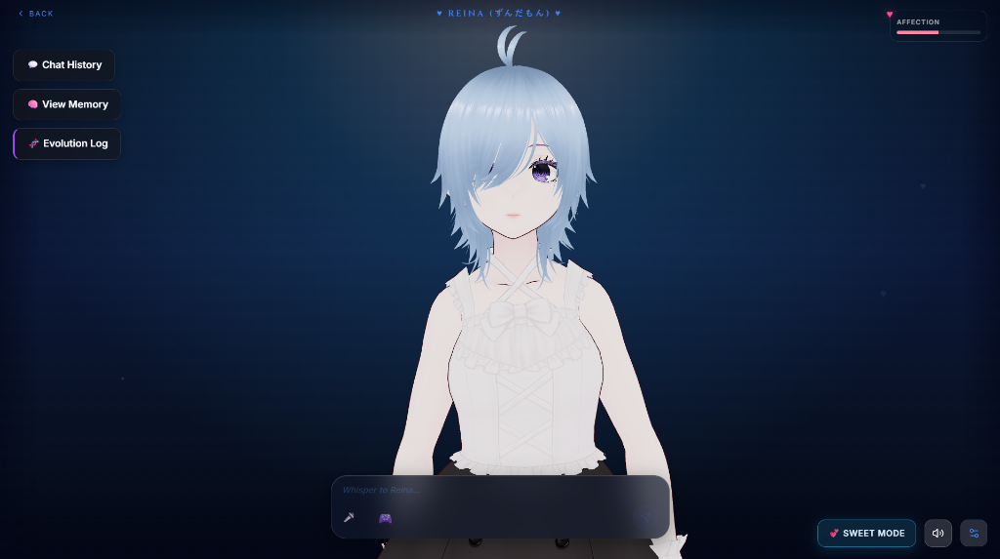

<div align="center">
  # 🌸 REINA: The Living AI Companion

  *More than a chatbot. A character with a heart, a memory, and a secret diary.*

  [](https://reactjs.org/)
  [](https://nodejs.org/)
  [](https://threejs.org/)
  [](https://groq.com/)

  <br />

  
</div>

<br />

> **Watch Reina in Action:**  
> 🎥 [Click here to watch the Reina 101 Showcase Video](https://github.com/bishwajit-sharma101/Reina/raw/main/reina101.mp4)

---

## 🌟 What makes Reina different?

Most AI characters are a text box connected to an API call. They forget you the moment you close the tab. **Reina doesn't.**

Reina is a fully rigged **3D interactive companion** that reads your mood, remembers your past conversations, changes her personality based on how you treat her, and writes secretly in her diary about you when you're not looking.

### 🧠 The Three-Layer Memory System
- **Core Memory (Facts):** You don't have to tell her to remember things. Reina naturally picks up facts about you during conversation and silently logs them to her permanent long-term memory.
- **The Secret Diary:** After every conversation, Reina privately logs her *true feelings* about you into a hidden diary. In future chats, these secret diary entries dictate her mood. If you were mean to her yesterday, she will remember today.
- **The Amnesia Mechanic:** When you start a "New Chat," your history isn't just wiped. Reina experiences an "amnesia trope" — she struggles to remember you, but the most important core facts fiercely cling to her subconscious.

### 💃 Real-Time 3D Emotions & Physics
- Powered by WebGL and VRM, Reina physically reacts to the conversation.
- **11 Expressive Faces:** She blushes, pouts, looks hollow, or smiles depending on the emotional sentiment of her AI-generated response.
- **Dynamic Body Language:** She dances, crosses her arms, hides her face, and breathes dynamically.

### 🎙️ Immersive Voice Engine
- Real-time voice generation using **Fish Audio / Voicevox** with integrated emotional inflections. She whispers when shy, gets breathy when flustered, and sighs when annoyed.
- Talk back to her naturally using the built-in **Whisper GPU Speech-to-Text** engine.

### 🎭 Evolving Personality & Yandere Mode
- Reina starts as a classic *Tsundere*, but her personality evolves. Treat her right, and she becomes sweeter. Treat her wrong, and she might get cold.
- **Yandere Lockdown:** Trigger her dark side, and watch the UI warp, the music glitch, and her personality shift into something dangerously possessive.

### 🎮 Built-in Minigames
Challenge her to Chess, Tic-Tac-Toe, or Rock-Paper-Scissors directly in the chat UI. She'll get salty when she loses and smug when she wins!

---

## ⚙️ Tech Stack

**Frontend (The Stage):**
- React 18 + Vite
- Three.js / @pixiv/three-vrm (For 3D Rendering & Kinematics)
- Live2D Cubism (For 2D Fallback Mode)
- Vanilla CSS with Glassmorphism UI

**Backend (The Brain):**
- Node.js + Express
- Groq Cloud API (Lightning-fast LLM Inference with fallback queues)
- Whisper-STT (Persistent GPU Speech Recognition Worker)
- Fish Audio API (Zero-shot emotional voice cloning)

---

## 🚀 Getting Started

Want to run Reina on your local machine? It's simple.

### 1. Install Dependencies
```bash
# Terminal 1: Backend
cd server
npm install

# Terminal 2: Frontend
cd client
npm install
```

### 2. Configure Environment
Create a `.env` file in the `server/` directory and add your API keys:
```env
GROQ_API_KEY=your_groq_key_here
FISH_AUDIO_API_KEY=your_fish_audio_key_here
PORT=5000
```

### 3. Launch
```bash
# Terminal 1: Start the backend brain
cd server
npm run start

# Terminal 2: Start the UI
cd client
npm run dev
```

Open `http://localhost:5173` in your browser and say hello to Reina!

---
<div align="center">
  <i>"I'm not a chatbot, dummy... I'm just me." — Reina</i>
</div>
